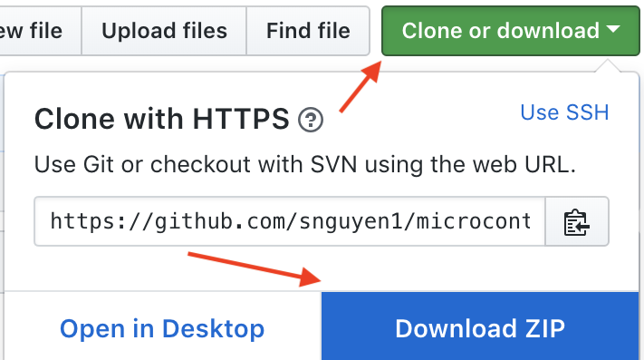
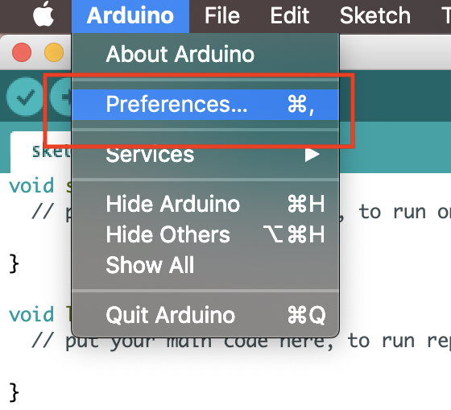
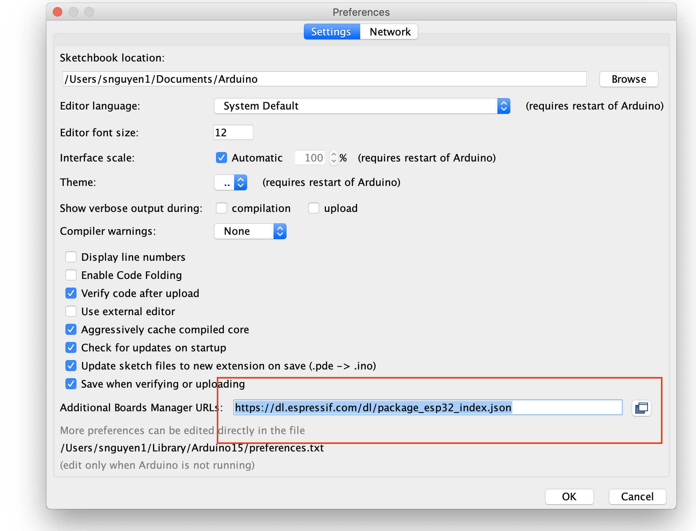
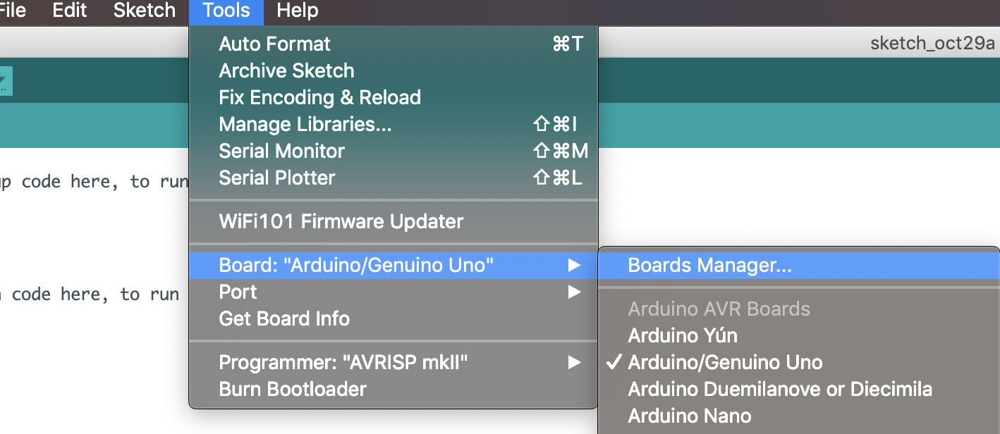
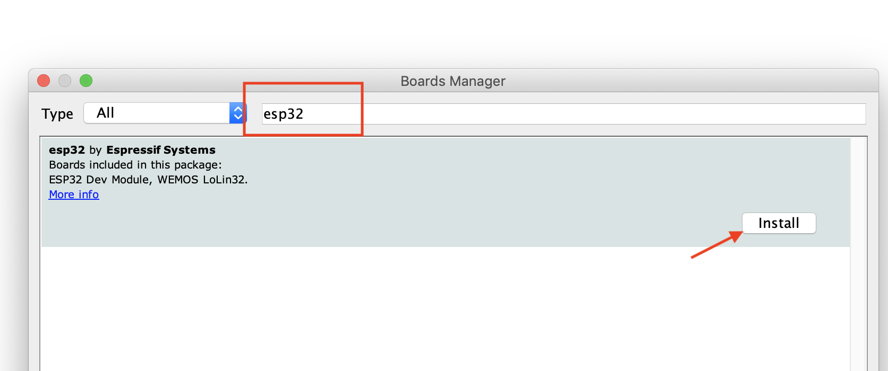
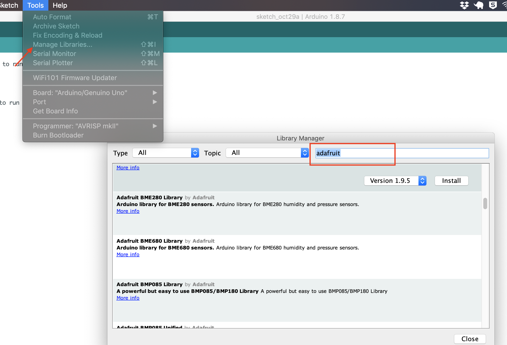

HRI Microcontroller Workshop
================================
This repository will contain the teaching material and other info associated with our Microcontroller tutorial at
the HRI Researchers' Microcontroller Workshop held on Nov 7 2018 @ HRI-127 - Texas A&M University - Corpus Christi

#### Prior to the HRI Researchers Microcontroller Workshop on 7 November 2018, you should prepare your laptop with the software that is needed for the event. We will be using the “Arduino IDE” (IDE=integrated development environment), or for short, just “Arduino software”, which is freely available for Windows or Mac OS X (and Linux, too!).

Instructors/Contributors
-----------

- Michael van den Eijnden [[Github](https://github.com/mickel1138)]
- Michael S. Williamson [[Github](https://github.com/fightingtexasaggie)]
- Mark Besonen 
- Mikell Smith
- Joe Holland
- Son Nguyen

---

# Table of Contents

<!-- TOC -->
- [1.   Preparation before the Workshop](#preparation-before-the-workshop)
    - [1.1  Tutorial Download](#tutorial-download)
    - [1.2  Installation of Microcontroller Software and Drivers](#installation-of-microcontroller-software-and-drivers)
        - [a.   Mac OS](#for-mac-os)
        - [b.   Windows](#for-windows)

<!-- /TOC -->


# Preparation before the Workshop

## Tutorial Download
---------------------

If you have a GitHub account, it is probably most convenient if you clone or
fork the GitHub repository. You can clone the repository by running:

```bash
git clone https://github.com/snguyen1/microcontroller-workshop-1.git
```

 If you are not familiar with git, you can download the repository as a .zip file by heading over
to the GitHub repository (https://github.com/snguyen1/microcontroller-workshop-1) in
your browser and click the green “Download” button in the upper right.


Please note that we may add and improve the material until shortly before the
tutorial session, and we recommend you to update your copy of the materials one
day before the tutorials. If you have an GitHub account and cloned the
repository via GitHub, you can sync your existing local repository with:

```bash
git pull origin master
```

If you don’t have a GitHub account, you may have to re-download the .zip
archive from GitHub.

## Installation of Microcontroller Software and Drivers

### For Mac OS
Step 1— Download and install the Arduino software
- Visit https://www.arduino.cc/en/Main/Software and download the MacOS X version of the Arduino software installer
- Install the software per the instructions at https://www.arduino.cc/en/Guide/MacOSX. Skip the last section of the installation instructions, i.e. the “Proceed with board specific instructions” portion

Step 2— Open the Arduino Software
- Start up the Arduino software. The icon should be in your Applications folder; the Arduino icon looks like a white “Figure-8” on a blue-green background

Step 3— Configure the Arduino Software
 
#### (Same for both windows and mac)

- Add the necessary libraries (libraries are like “drivers”) to let the Arduino software know how to communicate with the ESP32 microcontroller and components we will be using
- To add support for the ESP32 microcontroller, click on File -> Preferences 


- Paste “https://dl.espressif.com/dl/package_esp32_index.json” (without the quotes) into the blank space next to “Additional Boards Manager URLs:" then lick “OK” to return to the main Arduino software window.


- Click on Tools -> Board: “Arduino/Genuine Uno -> Boards Manager…. 


- Type “esp32” (without the quotes) into the filter at the top of the Boards Manager dialog; you should see an “esp32 by Espressif Systems” option appear.
Click on its “Install” button, and let the process run to completion; altogether it has to download about 150MB of additional data at this point so it will take several minutes; when this install is finished. Click the "Close" button once the install is completed.


- To add support for the various components we will be using, click on Tools -> Manage Libraries…,

- Type “adafruit” (without the quotes) into the filter at the top of the Library Manager dialog; similar to adding support for the ESP32 microcontroller like in the last step
- Find & Install the “Adafruit BME280 Library by Adafruit”, “Adafruit SSD1306 by Adafruit”, and “Adafruit Unified Sensor by Adafruit” libraries.
- Update the filter text to “rtclib”, and install the “RTClib by Adafruit” library.
- Click the “Close” button to return to the main Arduino software window

### For Windows
Step 1— Download and install the Arduino software
- Visit https://www.arduino.cc/en/Main/Software and download the Windows version of the Arduino software installer depending on your system (Windows 7, 8 10, etc...)
- Install the software per the instructions at https://www.arduino.cc/en/Guide/Window. Skip the last section of the installation instructions, i.e. the “Proceed with board specific instructions” portion

Step 2— Open the Arduino software
- Start up the Arduino software. The installer should have left an Arduino icon on your desktop
- After launching the software for the first time, you may see a Windows Security Alert dialog warning that “Windows Firewall has blocked some features of this program”; if so, click the “Allow access” button for this alert so that the Arduino software can download additional components it needs for the workshop

Step 3— Configure the Arduino software (see Step 3 for Mac OS or click [here](#same-for-both-windows-and-mac))

## If you run into problems…

If you run into problems, please visit either Mickel Van Den Eijnden or Michael Williamson in HRI 310, or Mark Besonen in HRI 215B, for a hand. Otherwise, congratulations, your computer is now ready for the microcontroller workshop!